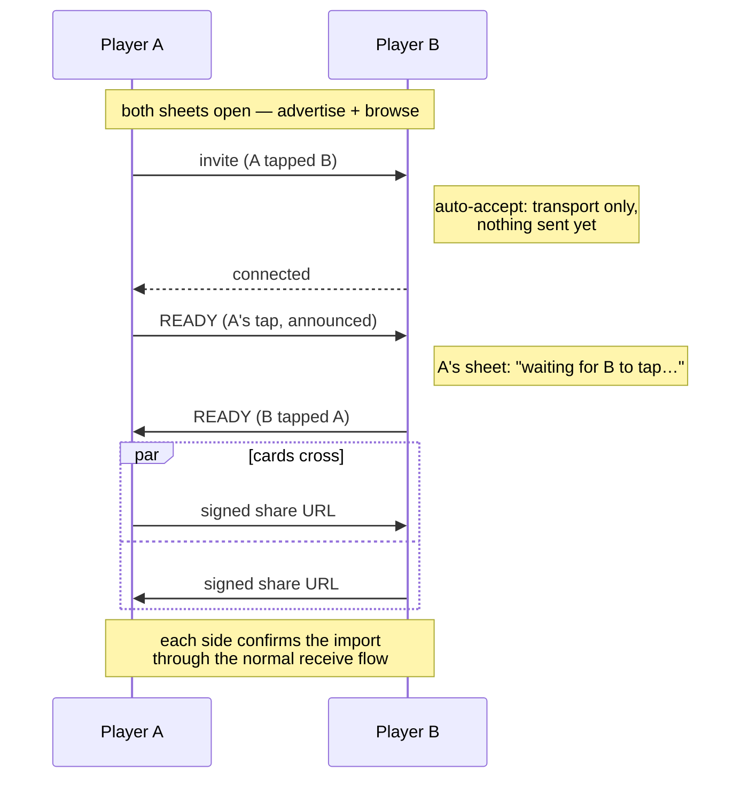
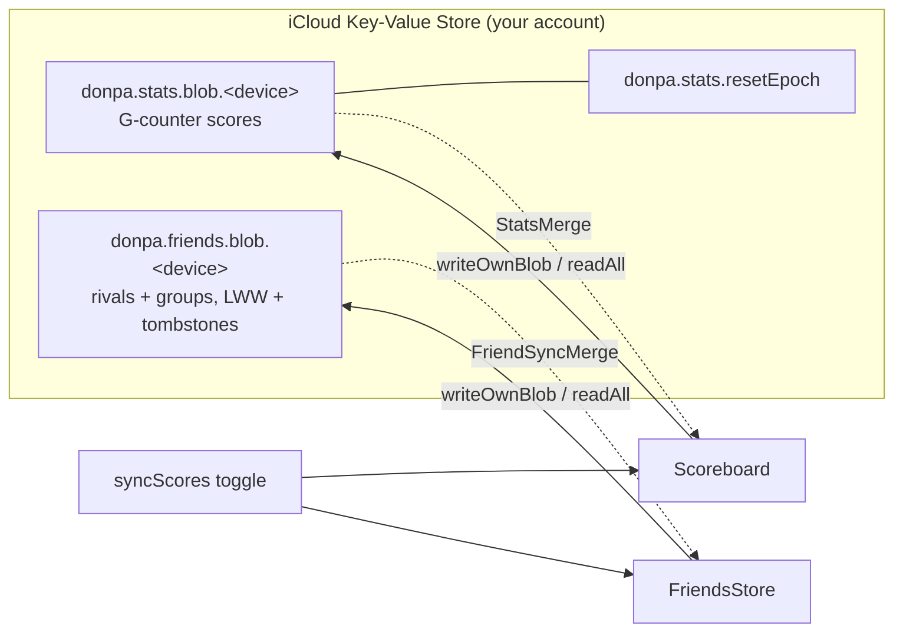

# Architecture & key decisions

The load-bearing design choices and *why* they're that way — the context that
isn't obvious from the code or the commit that introduced it. For the day-to-day
contributor/agent guide (commands, conventions, the `Topology` / `CellLayout`
seams, repo layout) see [AGENTS.md](AGENTS.md); for what shipped see
[CHANGELOG.md](CHANGELOG.md); for what's planned see [ROADMAP.md](ROADMAP.md).

## Module split: `DonpaCore` vs `DonpaKit`

- **`DonpaCore`** — pure game logic and value types (`Game`, `Board`, `Cell`,
  `Coord`, `GameConfig`, `Topology`, `Solver`, `GameSnapshot`), plus the
  headlessly-testable logic that supports the UI without depending on it:
  `CellLayout` (coordinate → pixel mapping, CoreGraphics only), `SaveStore`,
  `Scoreboard`, `TimeFormat`, and `GameViewModel` (the `@MainActor`
  `ObservableObject` orchestration — it's pure Combine/Foundation, no UI
  framework). No SwiftUI, no SpriteKit, no platform UI APIs. Fully unit-tested;
  deterministic.
- **`DonpaKit`** — the SwiftUI + SpriteKit UI layer; depends on Core. The bits
  that *must* import a UI framework stay here: `Settings` (imports SwiftUI for
  `ColorScheme` and alignment helpers) and `Palette` (carries `Color`/`SKColor`).
- The two app targets (`Sources/{iOS,macOS}`) are thin `@main` shells hosting
  `GameView()`.

Why: keeping the rules platform- and rendering-free means they're trivially
testable and the "epic" variants (hex, torus) drop in as new `Topology`
conformers without touching UI. It also keeps `swift test` fast (no Xcode
project, no simulator) as the inner loop.

**The target split *is* the coverage boundary.** Codecov gates `DonpaCore` and
ignores `DonpaKit/**` wholesale (the SpriteKit/SwiftUI layer needs UI automation
this project doesn't run). So the rule is: anything genuinely unit-testable lives
in `DonpaCore` and is covered automatically; the view layer lives in `DonpaKit`
and is ignored by a single glob — no per-file `codecov.yml` edits when a view
file is added or split for the lint length limit.

## Game state lives in value types; the view model bridges

`Game`/`Board` are **structs** (value semantics) — a move produces a new state,
which makes reasoning and testing simple and snapshots cheap. `GameViewModel`
(`@MainActor`, `ObservableObject`) owns the current `Game`, the timer, and input
mode, and republishes a `revision` counter on every change so the SpriteKit
scene knows to re-render without diffing.

Win/progress is **O(1)**: `Game.revealedSafeCount` is an incremental counter, so
`checkWin` never scans the board. This matters for the v0.2 huge-board goal and
already backs the progress-% feature.

**Value semantics are what make the off-main compute safe.** On a 1M-cell board a
reveal (flood-fill) or a new board (mine placement) is too heavy to run on the
main thread without freezing the UI, so `GameViewModel` mutates a *copy* of the
`Game` off the main thread (`computeOffMain`: snapshot the value — O(1) COW —
mutate in a `Task.detached`, then assign the result back on the `@MainActor` and
bump `revision`). Because `Game`/`Board` are `Sendable` value types this needs no
locking. A `gameID` generation guard discards a stale result if a new/restored
game started meanwhile; an `isComputing` flag gates input (and drives a debounced
overlay) so a tap can't land on a board mid-update. Mines are **pre-armed** off
the main thread on New Game (no safe zone yet), and the first reveal only
*relocates* any mines under the click — so the cost is paid while the player looks
at the fresh board, not on their first tap. To keep these paths O(mineCount) not
O(cells): `Cell` is bit-packed to one byte (cheap copy), `Board` stores its mine
set, placement rejection-samples indices, and the end-game effects are
viewport-culled.

## One config vocabulary: family × edges (× size × rank)

`GameConfig` is an **enum** — `.basic(preset)`, `.grid(size, density, edges)`,
`.hive(size, density, edges)` — making the board **family** (Basic / Grid / Hive)
and the **edges** (Flat / Round, i.e. bounded / torus) first-class axes. The 0.3.0
reshape retired the old `GameMode` (classic/modern) + shape-argument vocabulary
deliberately: the *same axes* now name the storage keys (`v2|grid|flat|16x16|m31`),
drive the New Game picker (families as pages/sidebar, an edges toggle), and filter
the scoreboard (Family + Edges narrowing to one leaf) — one vocabulary end-to-end,
so a new variant is a new enum case, not a parallel naming scheme in each layer.
Supporting choices that are easy to mistake for accidents:

- **Each family remembers its own selections.** `Settings` keeps per-family
  size/density/edges (via `sizePath`/`densityPath`/`edgesPath` key paths), so a
  huge Round hive session doesn't retune the next Grid game. `currentConfig`
  derives from the family's own fields; `Settings.adopt(config)` decomposes a
  `GameConfig` back into them — used when a game starts from a *specific* config
  (e.g. the scoreboard's "New game on this board") so the choice is remembered.
- **The scoreboard renders one `StatBlock` at two scopes** (lifetime career /
  one config's record) — deliberately the same component so the two always read
  alike. Rival comparison is a separate surface (`ScoreComparison` +
  `HeadToHeadView`; see the sharing section below), not another `StatBlock` scope.

## UI layout law: viewport shape, not platform

Screens that must span an iPhone SE to a wide Mac window pick between **distinct
layouts by the viewport's shape at runtime** — the New Game modal is the model
case (a swipe-pager on a tall-narrow viewport; a family sidebar + detail pane at
≥ a width breakpoint). This replaced one stretched-to-fit component, which bred
hacks (scale factors as cross-size crutches, measured placeholders, reflow
wobble) and still looked wrong at both extremes. The breakpoint is a runtime
value available everywhere, so the split is ordinary SwiftUI — **not** `#if os`:
platform conditionals stay reserved for genuinely native seams (cursor, key
handling, menus), which is also the pre-1.0 cleanup direction. Scrolling screens
(the scoreboard) instead use a single responsive flow — a scroll absorbs the
size range that a fixed modal can't.

## SpriteKit board, owned by SwiftUI, input handled natively

The board is a single long-lived `BoardScene` (`SKScene` + `SKCameraNode`) in a
SwiftUI `SpriteView`. **All board input — tap, click, flag, chord, pan, zoom —
is handled inside the scene** (`UIGestureRecognizer` / `NSEvent`), not via
SwiftUI gestures, because native handling is far more responsive and gives the
right platform feel (two-finger trackpad pan, right-click flag, the mode cursor).

Ownership is a DAG, not a cycle: `GameView` owns both the `viewModel`
(`@StateObject`) and the `scene` (`@State`); the scene references the view model,
but the view model never references the scene. (Audited leak-free — the Combine
timer uses `[weak self]`, effects are declarative `SKAction`s, and gesture
recognizers hold their target weakly by framework convention.)

## Keyboard: one vocabulary, one cursor engine, one focus keeper

The whole app is keyboard-drivable behind ONE settled vocabulary — Tab wraps
through a screen's visible control zones (first Tab enters at the start,
Shift-Tab at the end), arrows move within a zone, Return presses the focused
button (or the sheet's default — Done/confirm — when the focus isn't on one),
Space toggles the focused control, Esc backs out, and text fields start
editing the moment they're focused. Three shared pieces implement it, so a
new surface writes only its zone list, its entry mapping, and its activation
switch:

- **`KeyCursor`** (`Support/`) — the zone/index math as a pure, unit-tested
  value type; **`KeyStep`** for clamped ladders; **`Pulse`** for keyboard
  activation across a view boundary. Zone *visibility* must derive from the
  same predicates that render the controls — that single rule is what keeps
  "Tab reaches a hidden thing" impossible.
- **`KeyCatcher`** — an invisible AppKit first-responder that forwards raw
  keys to the host's handler. ONE per window (two would fight over first
  responder). It also reports mouse-downs (`.click`, never consumed): the
  pointer and the keyboard share one focus, so a click stands the ring down
  and a clicked focusable control takes the focus with it.
- **`BoardFocusKeeper`** — the board's first-responder policy (macOS): KVO on
  the window's `firstResponder` corrects any drift one runloop later while
  the board owns the keys. Ownership INCLUDES paused (Esc must reach the
  scene to resume) but never the title or a modal — that contract is why
  keepers and catchers never fight. Both platforms translate raw key events
  to a shared `BoardKeyCommand`, so the Mac and iPad maps can't drift.

## Two native app targets — *not* Mac Catalyst

The Mac app is a separate native AppKit/SwiftUI target, not Catalyst — for the
native Mac UX this app leans on: the mode cursor (`NSCursor`), click-vs-drag and
right-click (`NSEvent`), two-finger `scrollWheel` pan, menu-bar commands, and
`keyDown`. Under Catalyst those are exactly the weakest interactions.

Both targets share **one bundle id**, `fi.misaki.donpa` — a native Mac target
doesn't require a distinct id, and the shared id makes the two apps a single App
Store Connect record (**Universal Purchase**). An earlier revision of this
decision assumed a distinct `fi.misaki.donpa.mac`; that was reversed before
registering with Apple (the one moment it's cheap to change).

## Some UI workarounds are deliberate (don't "fix" them)

SwiftUI/SpriteKit interop on macOS needed a few non-obvious choices, each
documented at its call site:

- **Board cursor** uses an `NSTrackingArea` + explicit `NSCursor.set()`, not
  `addCursorRect` — cursor rects proved unreliable inside the hosted scene.
- **Palette/scheme** is resolved from one effective `ColorScheme` and pushed to
  the scene as a value (via `updateUIView`/`updateNSView`), because a view can't
  observe a scheme it forces on itself and `.onChange` was unreliable for the
  scene.
- **Escape / modal keys**: overlays use `.onExitCommand` (and a focusable
  `KeyCatcher` for the New Game popup) because an Escape menu key-equivalent
  isn't delivered by AppKit and the SpriteKit view holds first responder.
- **`onChangeCompat`** wraps `onChange` so the iOS-16 floor and macOS-14 share
  one warning-free call site (the zero/two-parameter form is iOS 17 / macOS 14
  only; the single-parameter form is deprecated on macOS 14).
- **`boardExceedsViewport` publishes via `DispatchQueue.main.async`**, not
  inline: it's written from the `SKScene` `update(_:)` loop, whose *first* tick
  fires synchronously inside SwiftUI's render pass (the scene presents
  mid-update) — an inline write to an observed `@Published` there trips
  "Publishing changes from within view updates". The one-turn hop lands the
  write after the pass; the value is a rarely-flipping bool, so the delay is
  immaterial. Don't "simplify" it back to a direct assignment.

## Persistence: compact, tagged, atomic, tolerant

The in-progress-game saves (`GameSnapshot` via `SaveStore`) and the scoreboard
(`Scoreboard`) are the two persisted stores. Both follow the same compatibility
rules so an app update never costs a player their data — the scoreboard
especially (losing a mid-game is a shrug; losing your records is not).

- **One save per config; the directory IS the index.** `SaveStore` keeps one
  file per board config under `saves/` (`save-<sanitized storageKey>`), so a
  round on another board never discards the huge XXXL game parked on the
  backburner. There is deliberately **no separate index file or database** —
  the directory listing is the index (enumerate to list, `unlink` to discard,
  nothing to drift). Finished (won/lost) games are cleared, and the tolerant
  decode also *rejects* a non-playing snapshot, so a stale save can never
  resurface as a "Continue".
- **Compact + tagged + compressed.** `GameSnapshot` stores the **`GameConfig`**
  (which *carries* the topology kind + params — the `any Topology` existential
  is never encoded) plus the first-click-safe mine layout and the
  revealed/flagged cells as **coordinate sets**, not the full cell dict (a
  1000² board would be huge otherwise). On disk each save is a
  **`DONPAZ1`-magic zlib container** — the magic versions the *container* while
  the JSON inside keeps its own schema version, and there is no plain-JSON
  fallback (anything without the magic is rejected like garbage; provably-dead
  relics are deleted on sight, while a *future* container version is hidden but
  preserved for the build that wrote it). A fresh XXXL save measures ~2.6×
  smaller, and the ratio improves as the contiguous revealed region grows. The
  scoreboard is a `[storageKey: ScoreRecord]` map (see below).
- **Sidecar summaries make listing cheap.** Every save gets a ~150-byte
  `summary-<key>` sidecar (config, elapsed, progress, last-played) written and
  removed **by the same code paths** as the main file — an index with no
  central registry to drift, self-healing (a missing sidecar is rebuilt from
  one full decode). Home's Continue card and the New Game in-progress dots read
  summaries, never the multi-MB saves; listing ~50 games went from ~1 s of JSON
  parsing to milliseconds. A `savesChanged` signal fires on every commit so
  those cues stay live even when a big board's first move is still computing
  when the surface opens.
- **Atomic.** `SaveStore` writes with `Data.write(.atomic)` (temp file +
  rename), so a crash mid-save can't corrupt it — the prior save survives.
  In-UI flushes are async (a blocking XXXL encode on the main thread was a
  visible stall); **blocking** saves remain only where the process may die
  (backgrounding, ⌘Q).
- **Versioned + additive.** Each store has a format `version`. New fields are
  added **optional-with-default**, so an older save still decodes in a newer app
  (the common, non-breaking case is free — no migration needed). A save from a
  *newer* app (`version > current`) is refused rather than mis-read.
- **Migration seam, migrations later.** Each store routes loads through a
  `migrated(…)` step (identity today — there are no breaking changes yet). When a
  truly breaking change lands, add one versioned transform there with a
  fixture-based test, rather than re-architecting. Same forward-compatible
  instinct as `storageKey`; don't build speculative migration code before a real
  migration exists.
- **Per-entry resilience (scoreboard).** Records decode **independently** — one
  corrupt or incompatible row is dropped, never failing the whole table. (The
  game save is a single object, so it's all-or-nothing by nature: a bad save is
  discarded and you start fresh.)
- **Never a crash or a broken state.** Anything unreadable / wrong-version /
  out-of-bounds is discarded; a restored game also filters out-of-bounds coords
  and recomputes its safe-cell count from the board.

`GameConfig.storageKey` (`v2|grid|flat|16x16|m31`) is itself a versioned,
geometry-bearing token: the family (`basic`/`grid`/`hive`) and edges
(`flat`/`round`) axes are named explicitly, so each variant — or a re-tuned
tier — creates **new** scoreboard entries rather than colliding with old ones.
(`v2` is the family vocabulary; `v1` keys spoke classic/modern + a shape axis
and were orphaned by the 0.3.0 score reset, not migrated.) Scores are local and
user-editable by design (no anti-cheat; lean on Game Center's server-side
validation if leaderboards land).

## Score sync: per-device blobs, CRDT-ish merge, epoch tombstones

Cross-device score sync (opt-in, off by default) rides **iCloud key-value
storage** — no server, no accounts, ~1 MB, fits a scoreboard. Blobs are
zlib-compressed (the verbose JSON shrinks ~20×, so even a maxed-out multi-device
fleet stays far under the shared quota) and sniffed on read. The design goal is
that no device ever *overwrites* another's history:

- **One blob per device** (`donpa.stats.blob.<deviceID>`). A device only ever
  writes its own blob; every device's display is a **merge** of all visible
  blobs. Counters merge as a G-counter (each record keeps `mine` +
  `othersTotal`), best times stay owned by the device that set them, and top-N
  lists union + dedup. Merge is commutative/idempotent, so sync order never
  matters and there are no conflicts to resolve.
- **Offline shows a projection, not a snapshot.** The last merge is cached; while
  unreachable, fresh local records are projected over the cached others-view
  (`StatsMerge.offlineMerge`) so offline play shows immediately, and the
  foreground refresh re-pushes on reconnect. A delete that couldn't reach iCloud
  (reset / sync-off while offline) is remembered and replayed, so no ghost blob
  keeps inflating other devices' totals.
- **Erasure needs a tombstone.** A "wipe all synced devices" can't just delete
  blobs — an offline device would re-upload its copy later and resurrect
  everything. So a wipe bumps a monotonic **reset epoch** (`donpa.stats.
  resetEpoch`); every blob and cache is stamped with the epoch it was written
  under, and anything stamped below the current epoch is ignored and cleaned up
  wherever it resurfaces. Devices honor a newer epoch by wiping themselves on
  their next read — including a device whose sync was off during the wipe, which
  is warned before opting back in. The epoch floor also doubles as a one-time
  "orphan all pre-rebalance scores" switch.

## Device identity: a UserDefaults id, a Keychain marker, and the fork

The per-device blobs above are keyed by a **`DeviceID`** — a UUID minted once
and stored in **UserDefaults**, deliberately not `identifierForVendor` (iOS
only) or any hardware id (none is stable + cross-platform, and Apple gives
third-party apps no phone-to-phone hardware id anyway). The consequences that
shape everything here:

- **The id must ride with the data.** UserDefaults travels with a backup /
  device transfer, and the local score store travels with it — so a normal
  migration is a **clean takeover**: the new hardware keeps publishing to the
  same blob slot, no duplication. A hardware-pinned id would leave the id
  behind while the data moved, and the new device would republish the whole
  migrated history under a fresh id — double-counting everything.
- **"Scores by device" is a read, not a store.** Because each blob holds only
  its own device's records, the whole feature — the per-device list
  (`DeviceScoresView`), attribution glyphs (`DeviceAttribution`, unambiguous
  class only), and the class-filtered career (`DeviceClassCareer`, the same
  `StatsMerge.merge` over a filtered table set) — derives at read time, needs
  no new collection, and works retroactively over existing blobs. Nicknames
  are the one addition: a synced `DeviceID → name` map in its own KVS
  namespace (`donpa.deviceNick.`), so iCloud's own last-writer-wins is the
  per-entry LWW and a name can follow a migration or label a ghost.
- **Migration is detectable** (`CloneDetection`). The id rides UserDefaults;
  an **install marker** — a Keychain item marked *ThisDeviceOnly* — rides the
  hardware and does NOT survive a restore onto a different device. "Stored id
  present, marker gone" = migrated → a one-time continue-or-fork prompt. A
  pre-feature install (id, no marker history) reads as established, never
  migrated.
- **The fork is staged, applied at launch** (`DeviceFork`). Every store
  captures its `DeviceID` at init, so switching id in-process would push fresh
  (empty) data under the OLD id and destroy the history the fork exists to
  preserve. So "Start as a new device" stages a flag; `DeviceIdentity.bootstrap`
  applies it FIRST at next launch — mint a fresh id, reset only the
  counter-bearing local stores (scores, daily); the old blobs stay in the
  cloud **untouched** (the fork never writes the cloud). The next merge shows
  identical household totals — only provenance moves.
- **A kept-alive clone is surfaced, not prevented.** If a migrated device
  keeps playing while the original also does, both write one slot
  (last-writer-wins). Each blob write carries the install marker as a
  **writer stamp**; a device seeing a foreign stamp in its own slot knows two
  live installs share the id (`idCollisionDetected`) and points at the fork.
  This is the one case the model can't make lossless — detection + the fork is
  the mitigation, documented as such.

## Navigation: a Home hub over an always-mounted board

The app is a **game with a menu, not an app with tabs** — a tab bar over a
pan/zoom board is hostile (edge pans, mis-taps) and translates badly to the Mac
window, so the 0.4.0 nav redesign made the title a real **Home hub** instead:
Continue (the latest in-progress board, expandable to all of them), New Game,
the Service Record, and the **Mess hall** (the social screen: share card
and rivals), with Settings/About as corner utilities.

- **The board stays mounted underneath; Home is an opaque overlay.** That's what
  makes resume instant — leaving a game is `pause + save + showingTitle = true`,
  never a teardown. `Navigator` (an `ObservableObject` of presentation flags
  shared with the macOS menu bar) drives everything.
- **Launch lands on Home** — no silent auto-resume into "whichever board was
  last": the Continue card is one predictable tap (`⏎` on Mac).
- **One `SaveStore` instance, shared reader/writer.** `GameViewRoot` owns it and
  passes it into `GameContent`; the popup's cues read the *same* files the game
  writes. (Two independently-constructed stores once diverged silently under the
  UI-test ephemeral mode — the reader minted a fresh temp dir per access.)
- **Every path to a fresh game goes through the full New Game picker** — no
  quick-start presets on Home or in the Mac menu, deliberately: the picker is
  the feature showcase (families, sizes, densities, edges), and the classics are
  intentionally un-promoted. The picker defaults to the last-played config, so
  repeat starts are one tap anyway.

One layout lesson from the redesign worth keeping: **never make measured-slot
content greedy.** The New Game pager sizes its slot by *measuring* its pages;
when the pages gained `Spacer`-based distribution, the measurement reported the
stretched height and ratcheted the card to full screen. Spacer-distribution is
safe only where the container measures the *ideal* height (`fixedSize`), like
the sidebar's pane stack.

## Forced-guess odds: exact enumeration, conservative by construction

`GuessOdds` (DonpaCore, pure, tested) scores every player reveal and chord
against the PRE-action state, from player-visible information only — revealed
numbers plus the total mine count; flags are marks, not facts. Frontier
components are enumerated by backtracking (25-cell/step-budget caps), the
unconstrained interior couples in via binomial weights, and everything combines
in log space over non-negative counts so *certain safety* detection is exact.
Two verdict halves: **forced** = no certainly-safe cell anywhere, OR the pocket
is **sealed** (no future reveal can ever constrain it) and **rigid** (same mine
count in every layout) — an unresolvable coin you'd have to flip eventually.
**Survival** is the exact probability the action had; a chord's gamble is the
whole set it opens.

Boards ≤ XXL get the full analysis (~5–10 ms/click, off-main). The million-cell
XXXL uses a **local path**: walk the click's constraint component outward
(bounded by the same 25-cell cap — an easy board's sprawling frontier bails in
microseconds, measured 0.02 ms/click) and report only sealed+rigid pockets,
whose odds rigidity makes exact without global knowledge. The invariant
everywhere: **exact or silent** — a position too tangled to analyze records
nothing rather than an estimate, so the stats are guaranteed accurate but not
guaranteed complete. Verdicts flow through `GameViewModel.onForcedGuess`
(stats) and `lastForcedGuess` (the toast/result-pill feedback, tiered by
`GuessTier`), landing in per-config `ScoreRecord` counters plus a min-merged
`luckiestGuess` record.

## Progression: derive gates, store feats — never the reverse

Two engines, deliberately opposite persistence models:

- **`UnlockEngine` derives, never stores.** Which sizes/ranks/families are
  open is a pure function over the merged score records — no unlock flags, no
  migration, and sync comes free with the records. Veterans pass every gate
  automatically, a stats reset re-locks the ladder, and the
  `-donpa.gates.fresh` launch flag can subtract launch-time win counts to
  show a veteran the fresh experience (plus live unlock moments) without
  touching data. Ladders are monotone on "win at or above the rung", so an
  escape-hatch win (a rival's bigger board via head-to-head or a share link —
  always playable by design) can never wedge a rung.
- **`AchievementStore` stores, never re-derives away.** Earned feats are
  id × tier → first-earned date, union-merged across devices (earliest date
  wins) under their own KVS namespace, and **exempt from the stats
  reset-epoch**: the hidden feats are momentary (unprovable from records) and
  Game Center can't un-report, so feats are permanent — history, not
  statistics. Derivable feats are stamped once when first observed
  (retroactively at launch), keeping dates stable and the future GC reporter
  single-shot.

The split matters: gates must follow the data wherever it goes (wipes, syncs,
restores), while feats must survive it.

## Score sharing: signed, serverless, peer-to-peer

Sharing scores with other people (v0.4.0, "friendly rivalry") is **serverless and
account-free** — the same philosophy as score sync, but between *different* people's
devices instead of one person's. The whole pipeline lives in `DonpaCore/Sharing`
(pure, headless, tested) with the SwiftUI/Keychain/camera glue in `DonpaKit/Sharing`.

- **Identity is a keypair, not an account.** Each device lazily mints a Curve25519
  signing key on first share (`ShareIdentity`), stored in a **synchronizable Keychain
  item** so all *your* devices present one identity. The public key *is* your share id.
- **A share is a signed, self-contained blob.** `ShareBody` (name + per-config
  bests/wins + optional career + `issuedAt`) is canonicalized (sorted-key JSON so
  signer and verifier hash identical bytes), signed, wrapped in a versioned
  `SharePayload`, then zlib-compressed + base64url'd by `ShareCodec` into a
  `https://donpa.app/s/<blob>` **Universal Link** (`ShareLink`) — which is also the QR.
  No server: everything needed to verify is in the blob. For 1.0 the link/QR **send**
  surfaces are parked (Nearby carries the same payload; see DECISIONS.md) — the
  codec and the receive path below stay live.
- **Receiving is trust-on-first-use.** A tapped link (`onOpenURL`) or scanned/imported
  QR (`ScanContent`) both funnel through **one** path: `ShareLink.payload` verifies the
  signature, then `FriendMerge.outcome` classifies it — genuine add, refresh, silent
  **rotation-migrate** (an old key signs a new one, so a friend's re-mint doesn't
  double them), ignore-stale (`issuedAt` replay guard), or a **name collision** the UI
  resolves (keep-both / replace / cancel). Decode is defensive: decompression-bomb cap,
  version reject, shape + value-range checks, storage-key allowlist, bidi/control-char
  name sanitization, signature-checked-before-trusted.
- **Display-merge, never storage-merge.** A rival's scores live ONLY in `FriendsStore`,
  never folded into your own `Scoreboard`. Comparison (`ScoreComparison`: per-config
  leaderboard + head-to-head) reads both and interleaves at display time — so removing
  a rival just drops their record, with nothing to disentangle from your stats.
- **Nearby exchange is a transport, not a second pipeline.** `NearbyExchange`
  swaps the *same* signed share URL both ways over MultipeerConnectivity
  (encryption required) — the received bytes re-enter the exact scan/link classify
  path, so all the verification above applies unchanged. Both sides advertise *and*
  browse under one Bonjour type. Devices advertise a short prefix of their own
  public key, letting a browser hide the player's own other devices —
  self-recognition only; the full key is still checked on receive (and a self-add
  is classified `.own` and rejected gently). NFC was the wish, but iOS gives
  third-party apps no phone-to-phone NFC.

### The Nearby handshake: mutual taps, then cards

A connection is plain transport — an invitation is accepted automatically, but
**nothing rides it until both players have tapped each other's name**. A tap
arms your side and announces itself with a tiny READY marker; your card leaves
your device only once you're armed *and* their consent has arrived. So neither
player can pull the other's card one-sided: the transfer needs both taps, in
either order.

The handshake brain is `NearbyFlow`, a pure state machine (events in, actions
out — unit-tested headless); `NearbyExchange` is the MultipeerConnectivity
adapter that executes its actions.

Design notes, each a fix for a field failure:

- **Crossed invites** (both tap at once) previously raced two sessions into
  mutual collapse. Now exactly one side hosts: the invitation carries the
  sender's key tag, and the receiver accepts a crossed invite only when the
  deterministic tie-break (`NearbyFlow.acceptsCrossedInvite`) says so — the
  mirror rule makes the other side's invite win instead.
- **Transient drops auto-retry.** Multipeer churns through `.notConnected`
  while negotiating transports, and a mid-air drop used to be terminal. A
  failure before completion now rebuilds the `MCSession` (a failed session
  object isn't trustworthy) and re-invites with linear backoff, transparently,
  a bounded number of times (`NearbyFlow.maxAutoRetries`); discovery keeps
  running throughout, so retries never re-scan. Only an exhausted budget shows
  the failure sheet — whose Retry button re-targets the same peer with a fresh
  budget, because browse/advertise never stopped.
- **Resends are safe by construction.** A reconnect restarts the handshake and
  resends our card; the receiver keeps the first URL it saw and the
  friend-merge is idempotent, so duplicates are absorbed.
- **Old builds interop.** A pre-handshake build sends its card immediately on
  connect — that card is treated as its consent (its user did tap), while ours
  still waits for our tap. The READY marker contains spaces, which
  `URL(string:)` rejects, so old receivers ignore it by design.

## Rival-list sync: the same blob model, different merge

The rival list + groups sync across *your* devices under the **same `syncScores`
toggle** — but a friend set isn't a G-counter, it's a mutable set with per-record
edits, so the merge differs from scores:

- **Per-record last-writer-wins + soft-delete tombstones** (`FriendSyncMerge`). Each
  `Friend` (by public key) and `FriendGroup` (by id) carries `updatedAt` + `deletedAt`;
  merge keeps the newest per key across devices, and a delete is a **minimal tombstone**
  (key/id + timestamp, data stripped) that propagates so a friend can't resurrect from
  a device that missed the removal — without their data lingering in the blob.
- **Same transport as scores, own namespace.** `CloudFriendsStore` /
  `UbiquitousFriendsStore` mirror the score stack (per-device blob keyed by `DeviceID`,
  read-all-and-merge) under `donpa.friends.blob.<deviceID>`. Enabling sync **unions**
  both devices' rivals into the local set (nobody dropped, survives a later sync-off).

Two per-device-blob systems on one KVS, one sync gate, one `DeviceID`:

## Daily challenge: one deterministic board, no server

The daily is a pure function of the LOCAL date string — no server hands
out boards, so determinism carries the whole feature. Three places
non-determinism had to be squeezed out:

- **Hashing.** Swift's `Hasher` is randomized per process; the daily uses
  FNV-1a, pinned by a test (a drift would hand every player a new board).
- **First-click safety.** Relocating a mine out of the opening draws from
  a non-deterministic RNG, which would silently diverge players' boards.
  Instead the seed SCANS forward from the date hash until the pre-armed
  layout leaves the fixed start cell's neighbourhood mine-free — the
  relocation never fires, and the guaranteed 0-opening means the shared
  Start reveal opens the identical region for everyone. Attempts open in
  a REVIEW state (board visible, input locked); the clock starts on
  Start, so study is free and the time measures execution.
- **Config pick.** Even day-ordinals hash freely into the pool; odd
  ordinals hash into the pool minus BOTH even neighbours' picks. Every
  adjacent pair of days contains an odd member, so consecutive days can
  never repeat a config — O(1) for any date, no cycle, nothing baked.
  The pool table is append-frozen: resizing remaps every future day.

Records follow the scoreboard's proven shape: ONE aggregate line per day
(never per-attempt rows) in per-device blobs — best min-wins at merge
with the winning device's attempt ordinal riding along, attempts a
`DeviceCounter`, and a `playedLive` flag that only same-day completions
set. Streaks read `playedLive` alone, so replaying a missed day from the
calendar records results but can never repair a streak. Daily results
never touch a config's regular bests — the day is its own competition.
Shares carry a channel-sized window of the same records (full history
over Nearby, a rolling window on the parked QR/link channel) and receivers accumulate per
date, newest share winning its dates — long rivalries assemble full
histories from small cards.

## Feedback (sound + haptics) lives in DonpaKit, never Core

`Game`/`GameViewModel` stay **audio- and haptics-free** — pure logic that reports
*facts*, not effects. The feedback fires from the DonpaKit input layer
(`BoardScene`+Input) and `GameContent`, mirroring where the result haptic already
lived. The VM exposes plain callbacks — `onReveal(openedCells:flooded:)` — and the
host turns those into sound/haptic side effects: **Core reports, the UI reacts.**
Keeping it out of Core preserves the "trivially testable, platform-free rules"
boundary (see the module split) — a feedback effect can't leak into a `swift test`
run.

- **Sounds are procedural, like the app icon.** `Scripts/assets/make-sounds.swift`
  synthesises the `.caf` files deterministically (committed assets — no sample
  packs, no licensing to clear), the same generate-don't-embed instinct as the icon.
  `SoundPlayer` (a small stateful `@MainActor` class) preloads them once.
- **The audio-session category is the load-bearing choice.** The iOS
  `AVAudioSession` is `.ambient` + `.mixWithOthers`, so the hardware Ring/Silent
  switch mutes the game and Donpa **never interrupts other audio** (a podcast, music)
  — a game feedback layer should defer to whatever the phone is already playing.
- **"flood" = a 0-cell cascade, not a cell count.** The distinction between the
  plain open tick and the fuller flood sound keys on **whether a 0-cell auto-cascade
  ran** (surfaced as the `flooded` flag on `onReveal`), *not* on how many cells
  opened — because that matches the player's mental model of "it opened up," which a
  raw count doesn't.

## Question marks: a 4th CellState, opt-in, never a claim

`CellState.questioned` is a real fourth state riding the existing **2-bit cell
field** (code 3) — no new storage, it fits the byte-packed `Cell` alongside
covered/revealed/flagged.

- **A "?" is a private note, never a claim.** The load-bearing invariant: a
  question mark is excluded **everywhere a flag counts** — the mine counter, chord
  satisfaction, the over-flag cue, the minimap. It marks the player's own
  uncertainty; it asserts nothing about the cell.
- **But it still costs the Bare Hands purity bit.** A "?" is external memory, the
  same as a flag, so placing one violates the no-marks purity condition — it's a
  note, not a free pass.
- **Opt-in, and Core stays pure.** A `Settings` flag is threaded through to
  `Game.toggleFlag` as an argument; Core never *reads* the setting, it's *passed in*
  — so the rules stay a pure function of their inputs and the toggle-cycle behaviour
  is still exhaustively testable.

## Assets are generated, not hand-drawn-in-repo

The app icon, the B&W variant, the launch image, and the in-grid detonation mark
all come from **one procedural source** (`Scripts/assets/make-icon.swift`, pure
CoreGraphics) — reproducible, no binary-blob churn, and the launch screen and
in-app splash share the *same* rendered PNG so they can't drift. The manga
result/title panels are the exception: swappable PNG asset slots (currently
AI-generated; a commissioned artist could replace the slot with no code change —
verify commercial-use licensing before shipping).
