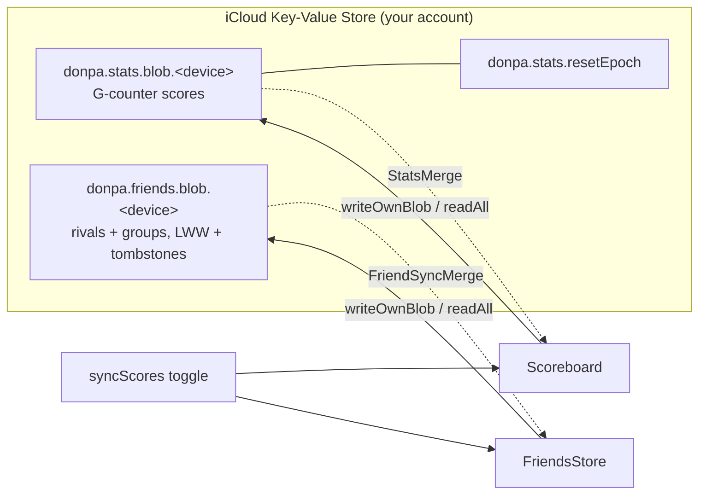

# Architecture & key decisions

The load-bearing design choices and *why* they're that way — the context that
isn't obvious from the code or the commit that introduced it. For the day-to-day
contributor/agent guide (commands, conventions, the `Topology` / `CellLayout`
seams, repo layout) see [AGENTS.md](AGENTS.md); for what shipped see
[CHANGELOG.md](CHANGELOG.md); for what's planned see [ROADMAP.md](ROADMAP.md).

## Module split: `DonpaCore` vs `DonpaKit`

- **`DonpaCore`** — pure game logic and value types (`Game`, `Board`, `Cell`,
  `Coord`, `GameConfig`, `Topology`, `Solver`, `GameSnapshot`), plus the
  headlessly-testable logic that supports the UI without depending on it:
  `CellLayout` (coordinate → pixel mapping, CoreGraphics only), `SaveStore`,
  `Scoreboard`, `TimeFormat`, and `GameViewModel` (the `@MainActor`
  `ObservableObject` orchestration — it's pure Combine/Foundation, no UI
  framework). No SwiftUI, no SpriteKit, no platform UI APIs. Fully unit-tested;
  deterministic.
- **`DonpaKit`** — the SwiftUI + SpriteKit UI layer; depends on Core. The bits
  that *must* import a UI framework stay here: `Settings` (imports SwiftUI for
  `ColorScheme` and alignment helpers) and `Palette` (carries `Color`/`SKColor`).
- The two app targets (`Sources/{iOS,macOS}`) are thin `@main` shells hosting
  `GameView()`.

Why: keeping the rules platform- and rendering-free means they're trivially
testable and the "epic" variants (hex, torus) drop in as new `Topology`
conformers without touching UI. It also keeps `swift test` fast (no Xcode
project, no simulator) as the inner loop.

**The target split *is* the coverage boundary.** Codecov gates `DonpaCore` and
ignores `DonpaKit/**` wholesale (the SpriteKit/SwiftUI layer needs UI automation
this project doesn't run). So the rule is: anything genuinely unit-testable lives
in `DonpaCore` and is covered automatically; the view layer lives in `DonpaKit`
and is ignored by a single glob — no per-file `codecov.yml` edits when a view
file is added or split for the lint length limit.

## Game state lives in value types; the view model bridges

`Game`/`Board` are **structs** (value semantics) — a move produces a new state,
which makes reasoning and testing simple and snapshots cheap. `GameViewModel`
(`@MainActor`, `ObservableObject`) owns the current `Game`, the timer, and input
mode, and republishes a `revision` counter on every change so the SpriteKit
scene knows to re-render without diffing.

Win/progress is **O(1)**: `Game.revealedSafeCount` is an incremental counter, so
`checkWin` never scans the board. This matters for the v0.2 huge-board goal and
already backs the progress-% feature.

**Value semantics are what make the off-main compute safe.** On a 1M-cell board a
reveal (flood-fill) or a new board (mine placement) is too heavy to run on the
main thread without freezing the UI, so `GameViewModel` mutates a *copy* of the
`Game` off the main thread (`computeOffMain`: snapshot the value — O(1) COW —
mutate in a `Task.detached`, then assign the result back on the `@MainActor` and
bump `revision`). Because `Game`/`Board` are `Sendable` value types this needs no
locking. A `gameID` generation guard discards a stale result if a new/restored
game started meanwhile; an `isComputing` flag gates input (and drives a debounced
overlay) so a tap can't land on a board mid-update. Mines are **pre-armed** off
the main thread on New Game (no safe zone yet), and the first reveal only
*relocates* any mines under the click — so the cost is paid while the player looks
at the fresh board, not on their first tap. To keep these paths O(mineCount) not
O(cells): `Cell` is bit-packed to one byte (cheap copy), `Board` stores its mine
set, placement rejection-samples indices, and the end-game effects are
viewport-culled.

## One config vocabulary: family × edges (× size × rank)

`GameConfig` is an **enum** — `.basic(preset)`, `.grid(size, density, edges)`,
`.hive(size, density, edges)` — making the board **family** (Basic / Grid / Hive)
and the **edges** (Flat / Round, i.e. bounded / torus) first-class axes. The 0.3.0
reshape retired the old `GameMode` (classic/modern) + shape-argument vocabulary
deliberately: the *same axes* now name the storage keys (`v2|grid|flat|16x16|m31`),
drive the New Game picker (families as pages/sidebar, an edges toggle), and filter
the scoreboard (Family + Edges narrowing to one leaf) — one vocabulary end-to-end,
so a new variant is a new enum case, not a parallel naming scheme in each layer.
Supporting choices that are easy to mistake for accidents:

- **Each family remembers its own selections.** `Settings` keeps per-family
  size/density/edges (via `sizePath`/`densityPath`/`edgesPath` key paths), so a
  huge Round hive session doesn't retune the next Grid game. `currentConfig`
  derives from the family's own fields; `Settings.adopt(config)` decomposes a
  `GameConfig` back into them — used when a game starts from a *specific* config
  (e.g. the scoreboard's "New game on this board") so the choice is remembered.
- **The scoreboard renders one `StatBlock` at two scopes** (lifetime career /
  one config's record) — deliberately the same component so the two always read
  alike. Rival comparison is a separate surface (`ScoreComparison` +
  `HeadToHeadView`; see the sharing section below), not another `StatBlock` scope.

## UI layout law: viewport shape, not platform

Screens that must span an iPhone SE to a wide Mac window pick between **distinct
layouts by the viewport's shape at runtime** — the New Game modal is the model
case (a swipe-pager on a tall-narrow viewport; a family sidebar + detail pane at
≥ a width breakpoint). This replaced one stretched-to-fit component, which bred
hacks (scale factors as cross-size crutches, measured placeholders, reflow
wobble) and still looked wrong at both extremes. The breakpoint is a runtime
value available everywhere, so the split is ordinary SwiftUI — **not** `#if os`:
platform conditionals stay reserved for genuinely native seams (cursor, key
handling, menus), which is also the pre-1.0 cleanup direction. Scrolling screens
(the scoreboard) instead use a single responsive flow — a scroll absorbs the
size range that a fixed modal can't.

## SpriteKit board, owned by SwiftUI, input handled natively

The board is a single long-lived `BoardScene` (`SKScene` + `SKCameraNode`) in a
SwiftUI `SpriteView`. **All board input — tap, click, flag, chord, pan, zoom —
is handled inside the scene** (`UIGestureRecognizer` / `NSEvent`), not via
SwiftUI gestures, because native handling is far more responsive and gives the
right platform feel (two-finger trackpad pan, right-click flag, the mode cursor).

Ownership is a DAG, not a cycle: `GameView` owns both the `viewModel`
(`@StateObject`) and the `scene` (`@State`); the scene references the view model,
but the view model never references the scene. (Audited leak-free — the Combine
timer uses `[weak self]`, effects are declarative `SKAction`s, and gesture
recognizers hold their target weakly by framework convention.)

## Two native app targets — *not* Mac Catalyst

The Mac app is a separate native AppKit/SwiftUI target, not Catalyst — for the
native Mac UX this app leans on: the mode cursor (`NSCursor`), click-vs-drag and
right-click (`NSEvent`), two-finger `scrollWheel` pan, menu-bar commands, and
`keyDown`. Under Catalyst those are exactly the weakest interactions.

Both targets share **one bundle id**, `fi.misaki.donpa` — a native Mac target
doesn't require a distinct id, and the shared id makes the two apps a single App
Store Connect record (**Universal Purchase**). An earlier revision of this
decision assumed a distinct `fi.misaki.donpa.mac`; that was reversed before
registering with Apple (the one moment it's cheap to change).

## Some UI workarounds are deliberate (don't "fix" them)

SwiftUI/SpriteKit interop on macOS needed a few non-obvious choices, each
documented at its call site:

- **Board cursor** uses an `NSTrackingArea` + explicit `NSCursor.set()`, not
  `addCursorRect` — cursor rects proved unreliable inside the hosted scene.
- **Palette/scheme** is resolved from one effective `ColorScheme` and pushed to
  the scene as a value (via `updateUIView`/`updateNSView`), because a view can't
  observe a scheme it forces on itself and `.onChange` was unreliable for the
  scene.
- **Escape / modal keys**: overlays use `.onExitCommand` (and a focusable
  `KeyCatcher` for the New Game popup) because an Escape menu key-equivalent
  isn't delivered by AppKit and the SpriteKit view holds first responder.
- **`onChangeCompat`** wraps `onChange` so the iOS-16 floor and macOS-14 share
  one warning-free call site (the zero/two-parameter form is iOS 17 / macOS 14
  only; the single-parameter form is deprecated on macOS 14).
- **`boardExceedsViewport` publishes via `DispatchQueue.main.async`**, not
  inline: it's written from the `SKScene` `update(_:)` loop, whose *first* tick
  fires synchronously inside SwiftUI's render pass (the scene presents
  mid-update) — an inline write to an observed `@Published` there trips
  "Publishing changes from within view updates". The one-turn hop lands the
  write after the pass; the value is a rarely-flipping bool, so the delay is
  immaterial. Don't "simplify" it back to a direct assignment.

## Persistence: compact, tagged, atomic, tolerant

The in-progress-game saves (`GameSnapshot` via `SaveStore`) and the scoreboard
(`Scoreboard`) are the two persisted stores. Both follow the same compatibility
rules so an app update never costs a player their data — the scoreboard
especially (losing a mid-game is a shrug; losing your records is not).

- **One save per config; the directory IS the index.** `SaveStore` keeps one
  file per board config under `saves/` (`save-<sanitized storageKey>`), so a
  round on another board never discards the huge XXXL game parked on the
  backburner. There is deliberately **no separate index file or database** —
  the directory listing is the index (enumerate to list, `unlink` to discard,
  nothing to drift). Finished (won/lost) games are cleared, and the tolerant
  decode also *rejects* a non-playing snapshot, so a stale save can never
  resurface as a "Continue".
- **Compact + tagged + compressed.** `GameSnapshot` stores the **`GameConfig`**
  (which *carries* the topology kind + params — the `any Topology` existential
  is never encoded) plus the first-click-safe mine layout and the
  revealed/flagged cells as **coordinate sets**, not the full cell dict (a
  1000² board would be huge otherwise). On disk each save is a
  **`DONPAZ1`-magic zlib container** — the magic versions the *container* while
  the JSON inside keeps its own schema version, and there is no plain-JSON
  fallback (anything without the magic is rejected like garbage; provably-dead
  relics are deleted on sight, while a *future* container version is hidden but
  preserved for the build that wrote it). A fresh XXXL save measures ~2.6×
  smaller, and the ratio improves as the contiguous revealed region grows. The
  scoreboard is a `[storageKey: ScoreRecord]` map (see below).
- **Sidecar summaries make listing cheap.** Every save gets a ~150-byte
  `summary-<key>` sidecar (config, elapsed, progress, last-played) written and
  removed **by the same code paths** as the main file — an index with no
  central registry to drift, self-healing (a missing sidecar is rebuilt from
  one full decode). Home's Continue card and the New Game in-progress dots read
  summaries, never the multi-MB saves; listing ~50 games went from ~1 s of JSON
  parsing to milliseconds. A `savesChanged` signal fires on every commit so
  those cues stay live even when a big board's first move is still computing
  when the surface opens.
- **Atomic.** `SaveStore` writes with `Data.write(.atomic)` (temp file +
  rename), so a crash mid-save can't corrupt it — the prior save survives.
  In-UI flushes are async (a blocking XXXL encode on the main thread was a
  visible stall); **blocking** saves remain only where the process may die
  (backgrounding, ⌘Q).
- **Versioned + additive.** Each store has a format `version`. New fields are
  added **optional-with-default**, so an older save still decodes in a newer app
  (the common, non-breaking case is free — no migration needed). A save from a
  *newer* app (`version > current`) is refused rather than mis-read.
- **Migration seam, migrations later.** Each store routes loads through a
  `migrated(…)` step (identity today — there are no breaking changes yet). When a
  truly breaking change lands, add one versioned transform there with a
  fixture-based test, rather than re-architecting. Same forward-compatible
  instinct as `storageKey`; don't build speculative migration code before a real
  migration exists.
- **Per-entry resilience (scoreboard).** Records decode **independently** — one
  corrupt or incompatible row is dropped, never failing the whole table. (The
  game save is a single object, so it's all-or-nothing by nature: a bad save is
  discarded and you start fresh.)
- **Never a crash or a broken state.** Anything unreadable / wrong-version /
  out-of-bounds is discarded; a restored game also filters out-of-bounds coords
  and recomputes its safe-cell count from the board.

`GameConfig.storageKey` (`v2|grid|flat|16x16|m31`) is itself a versioned,
geometry-bearing token: the family (`basic`/`grid`/`hive`) and edges
(`flat`/`round`) axes are named explicitly, so each variant — or a re-tuned
tier — creates **new** scoreboard entries rather than colliding with old ones.
(`v2` is the family vocabulary; `v1` keys spoke classic/modern + a shape axis
and were orphaned by the 0.3.0 score reset, not migrated.) Scores are local and
user-editable by design (no anti-cheat; lean on Game Center's server-side
validation if leaderboards land).

## Score sync: per-device blobs, CRDT-ish merge, epoch tombstones

Cross-device score sync (opt-in, off by default) rides **iCloud key-value
storage** — no server, no accounts, ~1 MB, fits a scoreboard. Blobs are
zlib-compressed (the verbose JSON shrinks ~20×, so even a maxed-out multi-device
fleet stays far under the shared quota) and sniffed on read. The design goal is
that no device ever *overwrites* another's history:

- **One blob per device** (`donpa.stats.blob.<deviceID>`). A device only ever
  writes its own blob; every device's display is a **merge** of all visible
  blobs. Counters merge as a G-counter (each record keeps `mine` +
  `othersTotal`), best times stay owned by the device that set them, and top-N
  lists union + dedup. Merge is commutative/idempotent, so sync order never
  matters and there are no conflicts to resolve.
- **Offline shows a projection, not a snapshot.** The last merge is cached; while
  unreachable, fresh local records are projected over the cached others-view
  (`StatsMerge.offlineMerge`) so offline play shows immediately, and the
  foreground refresh re-pushes on reconnect. A delete that couldn't reach iCloud
  (reset / sync-off while offline) is remembered and replayed, so no ghost blob
  keeps inflating other devices' totals.
- **Erasure needs a tombstone.** A "wipe all synced devices" can't just delete
  blobs — an offline device would re-upload its copy later and resurrect
  everything. So a wipe bumps a monotonic **reset epoch** (`donpa.stats.
  resetEpoch`); every blob and cache is stamped with the epoch it was written
  under, and anything stamped below the current epoch is ignored and cleaned up
  wherever it resurfaces. Devices honor a newer epoch by wiping themselves on
  their next read — including a device whose sync was off during the wipe, which
  is warned before opting back in. The epoch floor also doubles as a one-time
  "orphan all pre-rebalance scores" switch.

## Navigation: a Home hub over an always-mounted board

The app is a **game with a menu, not an app with tabs** — a tab bar over a
pan/zoom board is hostile (edge pans, mis-taps) and translates badly to the Mac
window, so the 0.4.0 nav redesign made the title a real **Home hub** instead:
Continue (the latest in-progress board, expandable to all of them), New Game,
the Service Record, and the **Mess hall** (the social screen: share card,
rivals, squads, scanner), with Settings/About as corner utilities.

- **The board stays mounted underneath; Home is an opaque overlay.** That's what
  makes resume instant — leaving a game is `pause + save + showingTitle = true`,
  never a teardown. `Navigator` (an `ObservableObject` of presentation flags
  shared with the macOS menu bar) drives everything.
- **Launch lands on Home** — no silent auto-resume into "whichever board was
  last": the Continue card is one predictable tap (`⏎` on Mac).
- **One `SaveStore` instance, shared reader/writer.** `GameViewRoot` owns it and
  passes it into `GameContent`; the popup's cues read the *same* files the game
  writes. (Two independently-constructed stores once diverged silently under the
  UI-test ephemeral mode — the reader minted a fresh temp dir per access.)
- **Every path to a fresh game goes through the full New Game picker** — no
  quick-start presets on Home or in the Mac menu, deliberately: the picker is
  the feature showcase (families, sizes, densities, edges), and the classics are
  intentionally un-promoted. The picker defaults to the last-played config, so
  repeat starts are one tap anyway.

One layout lesson from the redesign worth keeping: **never make measured-slot
content greedy.** The New Game pager sizes its slot by *measuring* its pages;
when the pages gained `Spacer`-based distribution, the measurement reported the
stretched height and ratcheted the card to full screen. Spacer-distribution is
safe only where the container measures the *ideal* height (`fixedSize`), like
the sidebar's pane stack.

## Forced-guess odds: exact enumeration, conservative by construction

`GuessOdds` (DonpaCore, pure, tested) scores every player reveal and chord
against the PRE-action state, from player-visible information only — revealed
numbers plus the total mine count; flags are marks, not facts. Frontier
components are enumerated by backtracking (25-cell/step-budget caps), the
unconstrained interior couples in via binomial weights, and everything combines
in log space over non-negative counts so *certain safety* detection is exact.
Two verdict halves: **forced** = no certainly-safe cell anywhere, OR the pocket
is **sealed** (no future reveal can ever constrain it) and **rigid** (same mine
count in every layout) — an unresolvable coin you'd have to flip eventually.
**Survival** is the exact probability the action had; a chord's gamble is the
whole set it opens.

Boards ≤ XXL get the full analysis (~5–10 ms/click, off-main). The million-cell
XXXL uses a **local path**: walk the click's constraint component outward
(bounded by the same 25-cell cap — an easy board's sprawling frontier bails in
microseconds, measured 0.02 ms/click) and report only sealed+rigid pockets,
whose odds rigidity makes exact without global knowledge. The invariant
everywhere: **exact or silent** — a position too tangled to analyze records
nothing rather than an estimate, so the stats are guaranteed accurate but not
guaranteed complete. Verdicts flow through `GameViewModel.onForcedGuess`
(stats) and `lastForcedGuess` (the toast/result-pill feedback, tiered by
`GuessTier`), landing in per-config `ScoreRecord` counters plus a min-merged
`luckiestGuess` record.

## Progression: derive gates, store feats — never the reverse

Two engines, deliberately opposite persistence models:

- **`UnlockEngine` derives, never stores.** Which sizes/ranks/families are
  open is a pure function over the merged score records — no unlock flags, no
  migration, and sync comes free with the records. Veterans pass every gate
  automatically, a stats reset re-locks the ladder, and the
  `-donpa.gates.fresh` launch flag can subtract launch-time win counts to
  show a veteran the fresh experience (plus live unlock moments) without
  touching data. Ladders are monotone on "win at or above the rung", so an
  escape-hatch win (a rival's bigger board via head-to-head or a share link —
  always playable by design) can never wedge a rung.
- **`AchievementStore` stores, never re-derives away.** Earned feats are
  id × tier → first-earned date, union-merged across devices (earliest date
  wins) under their own KVS namespace, and **exempt from the stats
  reset-epoch**: the hidden feats are momentary (unprovable from records) and
  Game Center can't un-report, so feats are permanent — history, not
  statistics. Derivable feats are stamped once when first observed
  (retroactively at launch), keeping dates stable and the future GC reporter
  single-shot.

The split matters: gates must follow the data wherever it goes (wipes, syncs,
restores), while feats must survive it.

## Score sharing: signed, serverless, peer-to-peer

Sharing scores with other people (v0.4.0, "friendly rivalry") is **serverless and
account-free** — the same philosophy as score sync, but between *different* people's
devices instead of one person's. The whole pipeline lives in `DonpaCore/Sharing`
(pure, headless, tested) with the SwiftUI/Keychain/camera glue in `DonpaKit/Sharing`.

- **Identity is a keypair, not an account.** Each device lazily mints a Curve25519
  signing key on first share (`ShareIdentity`), stored in a **synchronizable Keychain
  item** so all *your* devices present one identity. The public key *is* your share id.
- **A share is a signed, self-contained blob.** `ShareBody` (name + per-config
  bests/wins + optional career + `issuedAt`) is canonicalized (sorted-key JSON so
  signer and verifier hash identical bytes), signed, wrapped in a versioned
  `SharePayload`, then zlib-compressed + base64url'd by `ShareCodec` into a
  `https://donpa.app/s/<blob>` **Universal Link** (`ShareLink`) — which is also the QR.
  No server: everything needed to verify is in the blob.
- **Receiving is trust-on-first-use.** A tapped link (`onOpenURL`) or scanned/imported
  QR (`ScanContent`) both funnel through **one** path: `ShareLink.payload` verifies the
  signature, then `FriendMerge.outcome` classifies it — genuine add, refresh, silent
  **rotation-migrate** (an old key signs a new one, so a friend's re-mint doesn't
  double them), ignore-stale (`issuedAt` replay guard), or a **name collision** the UI
  resolves (keep-both / replace / cancel). Decode is defensive: decompression-bomb cap,
  version reject, shape + value-range checks, storage-key allowlist, bidi/control-char
  name sanitization, signature-checked-before-trusted.
- **Display-merge, never storage-merge.** A rival's scores live ONLY in `FriendsStore`,
  never folded into your own `Scoreboard`. Comparison (`ScoreComparison`: per-config
  leaderboard + head-to-head) reads both and interleaves at display time — so removing
  a rival just drops their record, with nothing to disentangle from your stats.

## Rival-list sync: the same blob model, different merge

The rival list + groups sync across *your* devices under the **same `syncScores`
toggle** — but a friend set isn't a G-counter, it's a mutable set with per-record
edits, so the merge differs from scores:

- **Per-record last-writer-wins + soft-delete tombstones** (`FriendSyncMerge`). Each
  `Friend` (by public key) and `FriendGroup` (by id) carries `updatedAt` + `deletedAt`;
  merge keeps the newest per key across devices, and a delete is a **minimal tombstone**
  (key/id + timestamp, data stripped) that propagates so a friend can't resurrect from
  a device that missed the removal — without their data lingering in the blob.
- **Same transport as scores, own namespace.** `CloudFriendsStore` /
  `UbiquitousFriendsStore` mirror the score stack (per-device blob keyed by `DeviceID`,
  read-all-and-merge) under `donpa.friends.blob.<deviceID>`. Enabling sync **unions**
  both devices' rivals into the local set (nobody dropped, survives a later sync-off).

Two per-device-blob systems on one KVS, one sync gate, one `DeviceID`:

## Assets are generated, not hand-drawn-in-repo

The app icon, the B&W variant, the launch image, and the in-grid detonation mark
all come from **one procedural source** (`Scripts/assets/make-icon.swift`, pure
CoreGraphics) — reproducible, no binary-blob churn, and the launch screen and
in-app splash share the *same* rendered PNG so they can't drift. The manga
result/title panels are the exception: swappable PNG asset slots (currently
AI-generated; a commissioned artist could replace the slot with no code change —
verify commercial-use licensing before shipping).
